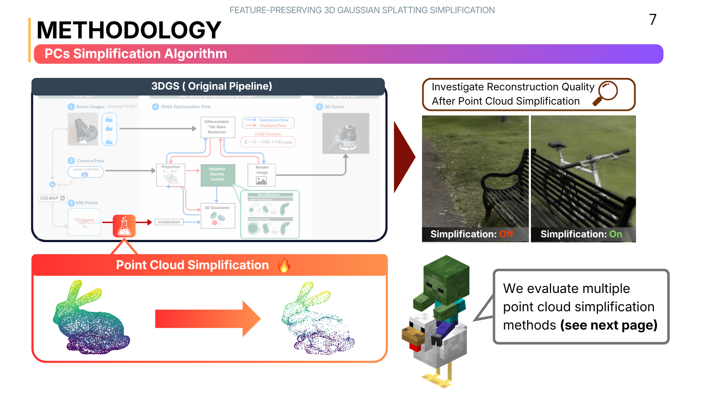
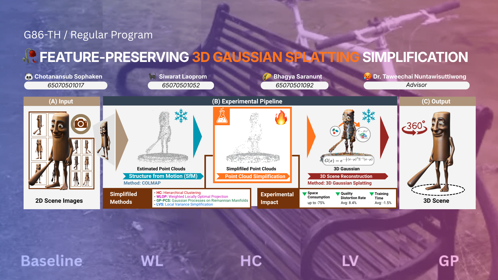
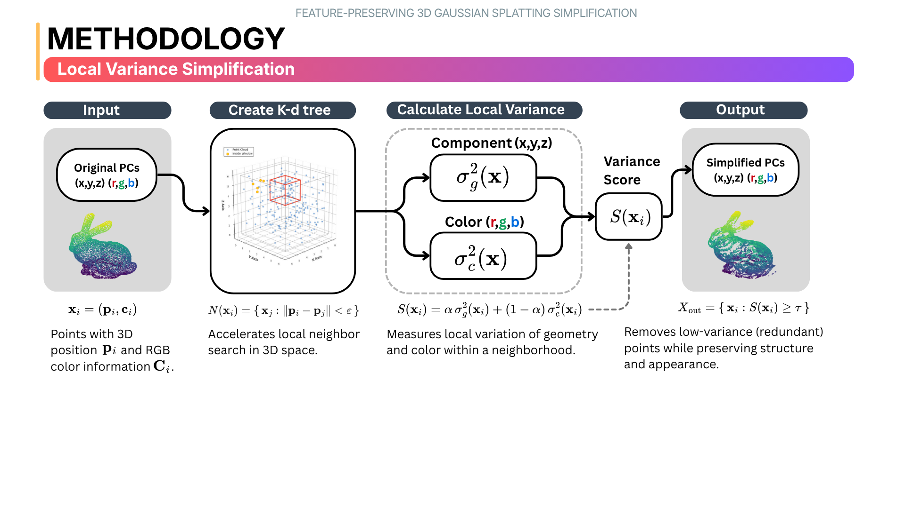
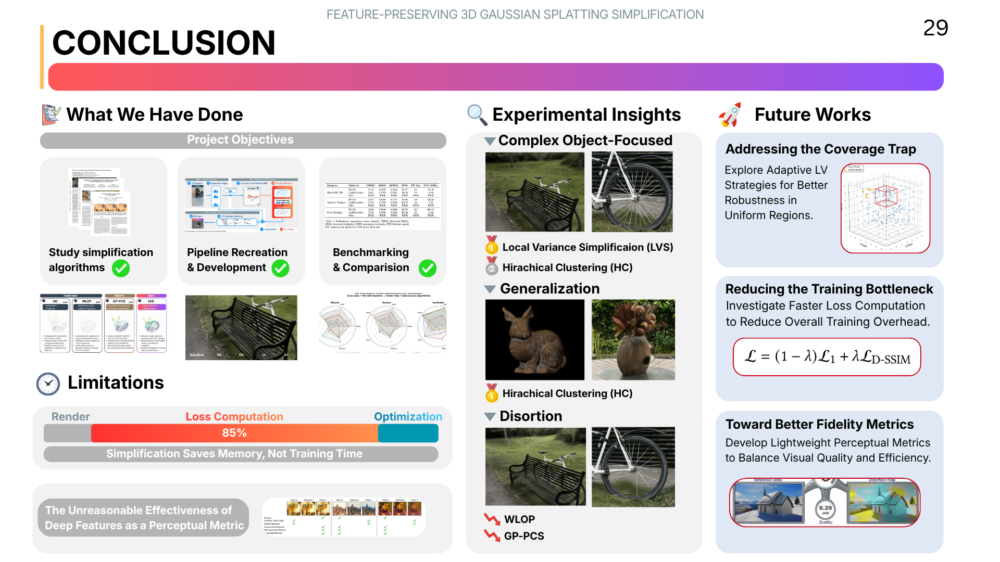

# Feature-Preserving 3D Gaussian Splatting Simplification

> **Computer Engineering Senior Project (Progress Report 2/2025)**  
> **B. Eng. Computer Engineering, Academic Year 2025**  
> **Department of Computer Engineering, King Mongkut's University of Technology Thonburi (KMUTT)**

[](#)
[](LICENSE)
[](#repository-aggregation-index)

---

## 👥 Group 86 & Academic Context

| Role | Name | ID | Contact |
| :--- | :--- | :--- | :--- |
| **Advisor** | **Dr. Taweechai Nuntawisuttiwong** | - | - |
| **Student** | Chotanansub Sophaken | 65070501017 | chotanansub.soph@kmutt.ac.th |
| **Student** | Siwarat Laoprom | 65070501052 | siwarat.laop@kmutt.ac.th |
| **Student** | Bhagya Saranunt | 65070501092 | bhagya.saran@kmutt.ac.th |

---

## 📝 Abstract

3D Gaussian Splatting (3DGS) is a rendering method that represents scenes using Gaussian primitives initialized from a sparse Structure-from-Motion point cloud, but its training process is computationally intensive and often contains redundant data, motivating the question of whether pre-simplifying the input point cloud can improve efficiency without degrading performance. 

This project investigates how characteristics of simplified point clouds—such as spatial distribution and feature density—affect the full 3DGS pipeline by evaluating four methods: GP-PCS, WLOP, Hierarchical Clustering (HC), and our proposed **Local Variance Simplification (LVS)** that preserves points in regions with high geometric or color variation. 

Experiments across multiple scenes, simplification levels, and training settings use PSNR, SSIM, LPIPS, training time, and final Gaussian count as metrics. Results show that the structure of the initial point cloud significantly influences outcomes, sometimes more than point count alone, with geometric characteristics strongly correlated with reconstruction quality (Pearson $r = 0.874, p < 0.000001$) and similarly sized point clouds differing by an average of $3.16\text{ dB}$ in PSNR due to distribution. No method consistently outperforms others across all scenes (Friedman $\chi^2 = 0.667, p = 0.717$), as performance varies by context. 

While simplification leads to about $8.4\%$ visual quality degradation in real-world data and reduces storage linearly with simplification ratio, it has only minor impact on training time; moreover, effectiveness depends on maintaining sufficient spatial coverage, as LVS can underperform in simple scenes where over-simplification removes structural details that densification cannot recover, highlighting that preprocessing choices meaningfully influence 3DGS performance depending on scene properties and settings. Additionally, we find that standard losses ($L_1$, SSIM) provide limited guidance for high-detail reconstruction. Thus, led to the experiment on a real/fake image classification from an open-source foundation model using neural network based approach. However, it drastically increases time complexity without meaningful gains in visual fidelity or convergence.

### 🔑 Keywords
`3D Gaussian Splatting` • `Point Cloud Simplification` • `Point Cloud Densification` • `Local Variance Simplification`

---

## 📊 Research Overview & Methodology

### 🔍 Main Research Area & Overall Pipeline
We examine the impact of point cloud preprocessing on the 3D Gaussian Splatting training pipeline. Below is the main research focus and our overall experimentation pipeline:

<p align="center">
  
</p>

<p align="center">
  
</p>

---

### ⚙️ Local Variance Simplification (LVS) Methodology
Our proposed simplification method, **Local Variance Simplification (LVS)**, focuses on preserving point cloud density in high-feature regions (i.e., areas with high geometric curvature or color variance) before initialization:

<p align="center">
  
</p>

---

### 🏆 Summary of Key Contributions
Our evaluations cover multiple scenes, simplification ratios, and metrics (PSNR, SSIM, LPIPS, training speed, and model file sizes):

<p align="center">
  
</p>

---

## 🗂️ Repository Aggregation Index

This repository serves as the central hub for the senior project, aggregating our core implementations, reference models, and visualization tools via **Git Submodules**:

| Folder / Path | Original Repository | Description |
| :--- | :--- | :--- |
| 🚀 [**`LVS-Local-variance-simplification`**](./LVS-Local-variance-simplification) | [LVS Repo](https://github.com/NokKhumLee/LVS-Local-variance-simplification.git) | **Our Proposed Method**: Implements Local Variance Simplification (LVS) designed to preserve points in high geometric or color variation regions. |
| 🌐 [**`3DGS-WebRenderer-for-GIF`**](./3DGS-WebRenderer-for-GIF) | [WebRenderer Repo](https://github.com/NokKhumLee/3DGS-WebRenderer-for-GIF.git) | **Web Demo Application**: Interactive application showcasing the visual application of our research and rendering simplified 3DGS configurations. |
| 📓 [**`Notebook-Archive`**](./Notebook-Archive) | [Notebooks Repo](https://github.com/NokKhumLee/Notebook-Archive/tree/main) | **Experimentation Hub**: Contains the complete archive of Jupyter notebooks covering evaluations, parameter tuning, metrics calculation, and models analysis. |
| 📦 [**`optimized-gp-pcs`**](./optimized-gp-pcs) | [GP-PCS Repo](https://github.com/NokKhumLee/optimized-gp-pcs.git) | **Baseline Reference Method**: Modified implementation of the official Gaussian Process Point Cloud Simplification (GP-PCS) work. |
| 🛠️ [**`3DGS_Colab_Utils-Mod`**](./3DGS_Colab_Utils-Mod) | [Colab Utils Repo](https://github.com/NokKhumLee/3DGS_Colab_Utils-Mod.git) | **Benchmarking Utilities**: Modded utilities and scripts tailored for running Google Colab environments to benchmark, evaluate, and investigate the official 3DGS pipeline. |

---

## 📥 Cloning and Initializing

Since the repository aggregates multiple projects using Git submodules, make sure to clone recursively or initialize them after cloning:

### 1. Clone recursively (Recommended)
```bash
git clone --recursive https://github.com/NokKhumLee/feature-preserving-3d-gaussian-splatting-simplification.git
```

### 2. Or initialize submodules in an existing clone
If you already cloned the repository without the `--recursive` flag, initialize and update the submodules with:
```bash
git submodule update --init --recursive
```
